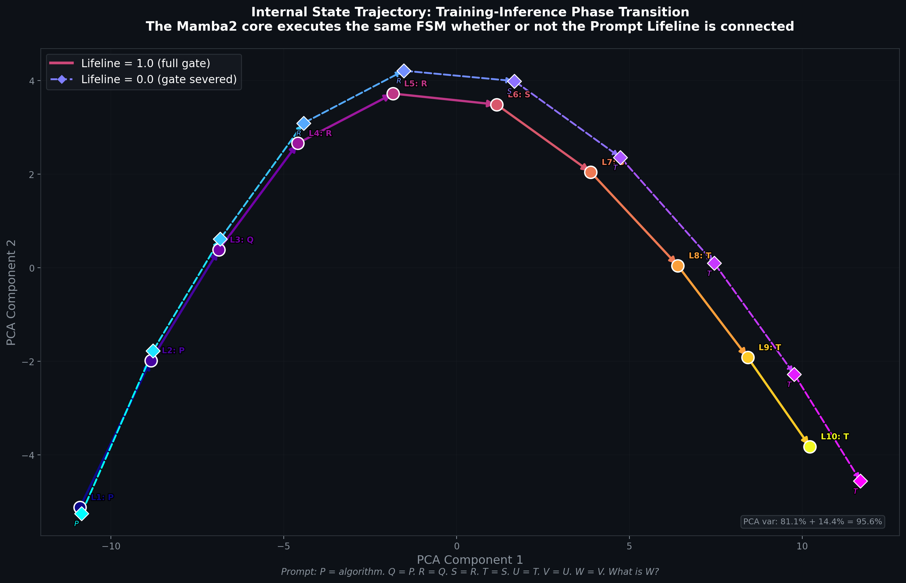

# Recursive Latent Forcing — Neural FSM via Training-Time Scaffolding

A 130M-parameter Mamba2 SSM that learns **discrete, stepwise symbolic computation** using an auxiliary training-time gradient highway (Prompt Lifeline). Once trained, the model executes a self-contained Finite State Machine autonomously — the scaffold is no longer needed at inference.

**Core Discovery**: State space models don't fail at reasoning — they fail at *learning to reason* due to temporal credit assignment collapse across recurrent depth. The Prompt Lifeline solves this by providing an O(1) gradient shortcut during BPTT. After convergence, the learned algorithm is fully internalized into the Mamba2 recurrent state.

---

## Key Results

| Result | Detail |
|--------|--------|
| **Accuracy** | 99.9–100% on 3,355 held-out chains (full 50,279-token vocabulary) |
| **Halt Precision** | `<HALT>` fires at p=1.000 at the correct reasoning depth |
| **Prior Override** | Counterfactual queries answered correctly at 90.9% against 130M pretrained priors |
| **OOD Generalization** | 8-hop chain solved by model trained only on 1–5 hops (via RoPE loop encoding) |
| **Inference Autonomy** | Lifeline can be zeroed at inference — control flow is fully internalized |

---

## Training–Inference Phase Transition

The Prompt Lifeline is a **training-time gradient highway**, not an inference dependency. Once trained, the Mamba2 core executes an identical internal FSM whether the lifeline is connected or severed:



The two trajectories (solid = lifeline active, dashed = lifeline zeroed) trace the **same path through state space** — the model has fully internalized the algorithm into its recurrent parameters. PCA captures 95.6% of variance in just 2 components, confirming the state trajectory is low-dimensional and discrete.

| Loop | Gate = 1.0 | Gate = 0.0 | Match |
|------|-----------|-----------|-------|
| L1 | P | P | ✅ |
| L2 | P | P | ✅ |
| L3 | Q | Q | ✅ |
| L4 | R | R | ✅ |
| L5 | R | R | ✅ |
| L6 | S | S | ✅ |
| L7 | S | T | ❌ |
| L8 | T | T | ✅ |
| L9 | T | T | ✅ |
| L10 | T | T | ✅ |

> **9/10 loops produce identical predictions.** The single divergence (L7) reflects a minor timing difference in the pointer advance — both trajectories converge immediately after.

---

## Architecture

```
Input
  │
  └──► Embedding (d=768)
         │
         ▼
     Layers 0-5   ← FROZEN (stable base features)
         │
         ▼
     x_prompt = x.clone()   ← snapshot for Prompt Lifeline
         │
   ┌─────▼──────────────────────────────────────────┐
   │         LOOP  (runs N times)                   │
   │                                                │
   │   x += gate ⊙ x_prompt  ← Prompt Lifeline     │
   │         │                                      │
   │   x = RoPE(x, loop_i)   ← composable position │
   │         │                                      │
   │     Layers 6-23 (LoRA rank=8)                  │
   │         │                                      │
   │   x += Mamba2_core(x)   ← d_state=64 FSM      │
   │         │                                      │
   │     loop_norm (RMSNorm)                        │
   │         │                                      │
   │   lm_head → loss vs chain_targets[loop_i]      │
   └────────────────────────────────────────────────┘
         │
       Answer (or <HALT>)
```

**Trainable**: 43.2M of 130M  |  **VRAM**: 0.46 GB  |  **Speed**: ~2,000–4,000 TPS

---

## Repository Structure

```
├── training/                  # Core v31–v34 training scripts
│   ├── finetune_mamba2_130m_v31.py   # Baseline (no lifeline)
│   ├── finetune_mamba2_130m_v32.py   # + Prompt Lifeline
│   ├── finetune_mamba2_130m_v33.py   # + Vector Gate + <HALT>
│   ├── finetune_mamba2_130m_v34.py   # + RoPE (OOD generalization)
│   ├── classes.py                     # Shared model classes
│   ├── v32_data_builder.py           # Training data generator (v32)
│   ├── v33_data_builder.py           # Training data generator (v33)
│   └── system2_logic_builder.py      # Core logic chain builder
│
├── probes/                    # Mechanistic interpretability experiments
│   ├── v34_hidden_state_probe.py     # FSM state analysis (logit margins)
│   ├── v34_causal_gate_ablation.py   # RAM/ALU gate ablation matrix
│   ├── v34_strict_ablation.py        # True zero / noise / shuffle ablation
│   ├── v34_state_reset_test.py       # State saturation ceiling test
│   ├── v34_full_ablation.py          # Full ablation sweep
│   ├── v34_final_check.py            # Quick inference check
│   ├── v31_probe.py                  # v31 baseline probe
│   ├── v32_cpu_probe.py              # v32 CPU probe
│   ├── v32_gpu_probe.py              # v32 GPU probe
│   ├── infinite_chain_probe.py       # Long-chain extrapolation
│   └── probe_v15.py                  # Legacy probe
│
├── data_builders/             # Dataset generation scripts
│   ├── logic_v*_generator.py         # Logic chain generators
│   ├── backbone_facts_*_builder.py   # Factual QA builders
│   ├── generate_*.py                 # Various data generators
│   └── ...
│
├── logs/                      # Training logs (gitignored)
├── archive/                   # Legacy scripts, benchmarks, reviews
│   ├── old_scripts/
│   ├── old_benchmarks/
│   ├── old_reviews/
│   └── old_data/
│
├── README.md                  # This file
├── TUTORIAL.md                # Full reproduction guide
├── requirements.txt
├── setup.py
├── mamba_scan.cpp             # CUDA kernel source
└── mamba_scan_kernel.cu
```

---

## Quick Start

### 1. Install
```bash
pip install torch transformers mamba-ssm
```

### 2. Train v34 (RoPE + Lifeline)
```bash
PYTORCH_ALLOC_CONF=expandable_segments:True \
python -u training/finetune_mamba2_130m_v34.py 2>&1 | tee logs/v34_train.log
```
Converges in ~1,500 steps (~1 hour on any RTX GPU).

### 3. Run the FSM probe
```bash
python probes/v34_hidden_state_probe.py
```

### 4. Run the inference autonomy ablation
```bash
python probes/v34_strict_ablation.py
```

---

## Version History

| Version | Key Change |
|---------|------------|
| v25 | MIMO Phase Rotator (unit-circle BPTT, JIT CUDA) |
| v28 | Latent Forcing — per-loop supervision, Mamba1 scan block |
| v29 | `<HALT>` token — model learns its own stopping criterion |
| v30 | Mamba2 backbone — `mamba2-130m` + Mamba2 loop engine |
| v31 | **Ablation baseline** — no lifeline (proves credit assignment failure) |
| v32 | **+ Prompt Lifeline** — skip connection re-injects prompt each loop |
| v33 | **+ Vector Gate + `<HALT>`** — float32 per-dim gate, full vocabulary |
| **v34** | **+ RoPE loop encoding** — 8-hop OOD generalization, inference autonomy proven |

---

## Research Paper

Full paper with ablation tables, mechanistic probes, and the Training vs. Inference Decoupling discovery:
`latent_forcing_paper_v33.md` (in the project AI artifacts directory)
